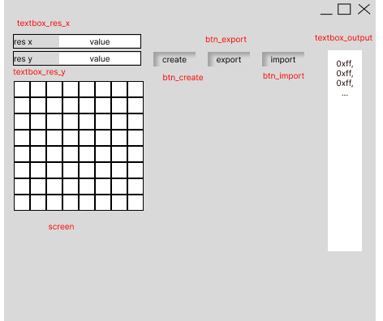

# new source code
./build/gui.py : generated with figma and Tkinter-Designer (used as a template)
./build/AppUI.py : re-Implementation of UI Class
./build/app.py : App implementation main entry point
'''
python app.py
'''
./build/ssd1327.py : SSD1327 Driver to be added

# app_sim_ssd1327
GUI APP that interact with SSD1327 driver

# Todo
1. Canvas scailing, with grid size. image object keep contain non-scaled info. ~ 1D
2. make canvas and image as gray scale type. ~1D
3. Add new combo box next to canvas and add Hex String Display map for display driver.(user can copy&paste) ~1D
4. improve drawing funcionality with differen color(greyscale) ~1D
    1. grey scale range 0 ~ 15 (where 0: black, 15: white)
5. Add export to file? (i don't understand) ~2D
    1. Export to {random_string}.txt
    2. File should contain values of res_x, res_y, and output(hex) code
6. Add Load image funcion with file open. Re-draw in grayscale and (size fitting?). ~1D
    1. Load an exported *.txt file. (File should contain res_x and res_y value)
    2. Parse res_x and res_y to regenerate pixel screen.
    3. Parse hex code and color pixels on the pixel screen.
7. Add Connect with driver ~3D
8. Add realtime communication ~ 2D
    1. Paint pixel driver prototype
        ```
        /**
        *
        * @param image_buffer grey scale buffer code
        * @param xPos x coordinate of drawing start
        * @param yPos y coordinate of drawing start
        * @param width pixel width of the image (do not confuse with size of the image_buffer)
        * @param height pixel height of the image
        */
        void Paint_DrawBitMapAt(const unsigned char* image_buffer, int xPos, int yPos, int width, int height)
        ``` 
    2. MCU should receive command to draw pixel via Serial Communication
    3. Serial Comm packet

        | size | char| int        | arraysizeof(buf)  | byte | byte | byte  | byte   | char|
        | ---- |:---:|:----------:|:-----------------:|:----:|:----:|:-----:|:------:|:---:|
        | desc | '@' | len_of_buf | buf[0:len_of_buf] | xPos | yPox | width | height | '#' |

## Main UI Sample


## Screen To Hex Example


> above image should generate {0xff, 0x00}
> which is {0b1111, 0b1111, 0b0000, 0b0000} at grey scale

